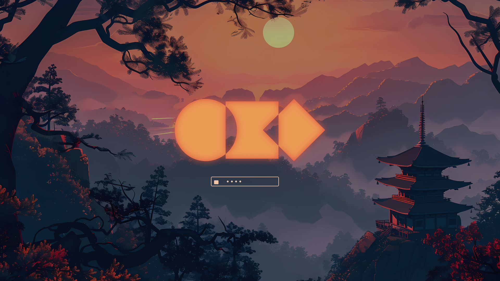

# Akane Theme

_Akane_ (茜) — _madder red_. A dusk-navy desktop with vermillion torii,
maple, and sunset gold, sampled from the bundled wallpapers.

Works on **Omarchy Quattro** (`colors.toml`) and on **pre-Quattro**
installs that still read per-app files (Waybar, Walker, Mako, Hyprlock,
`hyprland.conf`).

## Palette

| Role | Hex | From the art |
|------|-----|----------------|
| Background | `#12101c` | Pagoda / pine silhouettes |
| Foreground | `#f0c4a8` | Warm parchment, water light |
| Accent | `#e15a48` | Torii and maple vermillion |
| Gold | `#f0b45a` | Sun disk |
| Moss | `#7e9a6a` | Pine |
| Lake | `#4a9bb0` | Water and morning mist |
| Haze | `#5b7fa8` | Distant mountains |

The shared palette is `colors.toml`. Quattro generates terminals,
Hyprland Lua, Neovim, VS Code, Helix, btop, and Chromium from it.
The same colors are also written into the older theme files so
pre-Quattro desktops stay in sync.

## Install

```bash
omarchy theme install https://github.com/Grenish/omarchy-akane-theme
omarchy theme set akane
```

Or copy this directory to `~/.config/omarchy/themes/akane` and run
`omarchy theme set akane`.

Cycle wallpapers with `omarchy theme bg next`.

## Preview


Lock screen:


